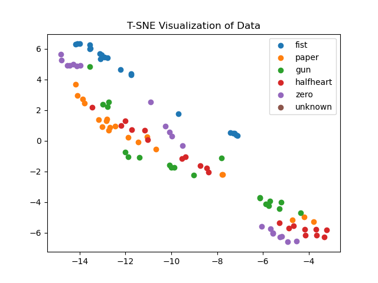
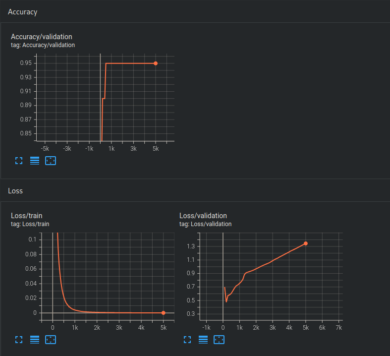

# Gesture Detection using MYO

## Project Structure

data/ - Contains the data files for training and testing the model
models/ - Contains the trained models

Data collected as 50hz, 8 channels, 10 seconds per gesture, 5 gestures (fist, paper, gun, half-heart, zero), preprocessed using low pass filter and FFT. Split data into chunks of 0.5 seconds (25 samples)

## Data Preprocessing

We simply take the mean of the 25 samples for each channel to get a 8-dimensional feature vector for each 0.5 second chunk. The following is a t-SNE visualization of the data for each gesture:



## Model

We use a simple feedforward neural network with parameters as such:

```
model = nn.Sequential(
    nn.Linear(dim, 16),
    nn.ReLU(),
    nn.Linear(16, 32),
    nn.ReLU(),
    nn.Linear(32, 6),
)
```

For the loss function, we use CrossEntropyLoss and for the optimizer, we use Adam.

This model is used to learn a represetntation of the gestures in the data. Which we then use later to detect out-of-distribution samples.

## Training

We train the model on the preprocessed data for 500 epochs. Validation accuracy is around 95%.



We can also visualize the learned representation of the gestures in the data using t-SNE:


## OOD Detection using KNN

As the final step of the pipeline, we use a KNN classifier to detect out-of-distribution samples. We use the minkowski distance to determine the 3-nearest neighbors and if the distance is greater than a 95% quantile threshold, we classify the sample as OOD. Otherwise, we simply classify it as one of the 5 gestures based on the majority class of the 3-nearest neighbors.

The following is a visualization of the OOD detection:


As we can see, most of the OOD samples (19/20) are classified as unknown.
